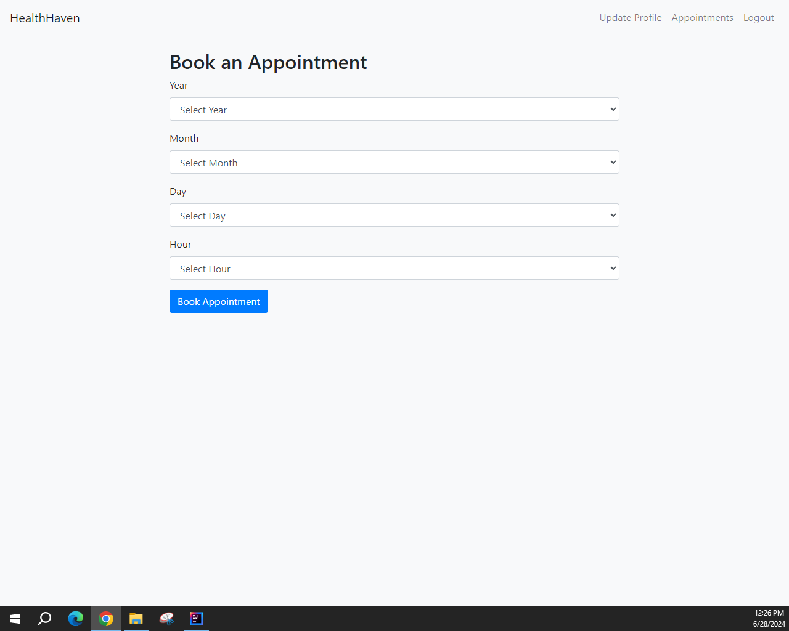

# HealthHaven

## Description

HealthHaven is a web-based application designed to streamline the management of doctor appointments. The application provides a seamless experience for both patients and doctors, allowing them to efficiently manage appointments and profiles.

## Technologies Used

- Java 11
- Spring Boot 2
- Spring Data JPA
- Spring Security
- Spring Boot Validation
- MySQL
- Thymeleaf
- jBcrypt
- Bootstrap

## Key Features

- **User Registration and Login**:
  - Users can sign up as either a doctor or a patient.
  - User authentication is implemented using Spring Security.
  - User credentials are securely stored in the database, and passwords are hashed using the BCrypt algorithm for enhanced security.
  - **Registration Success Modal**: After a successful registration, a modal appears confirming the successful registration.

- **Patient Dashboard**:
  - Patients can book appointments with doctors, update their profiles, and view their booked appointments.
  - **Search and Book Doctors**: Patients can search for doctors based on their speciality, and book an appointment with them. The booking process involves selecting a doctor, and selecting a date and time for the appointment. Validation is implemented to ensure the correctness of user inputs during the booking process. If the booking process is successful, a success modal appears.
  - **Viewing Appointments**: Patients can view their upcoming appointments and see the status of each appointment (e.g., pending, confirmed, cancelled).
  - **Updating Profile**: Patients can update their personal information, such as name, email, and phone number. **Profile Update Success Modal**: After successfully updating their profile, a modal appears confirming the successful update.

- **Doctor Dashboard**:
  - Doctors can view their appointments, update the status of appointments, and update their profiles.
  - **Managing Appointments**: Doctors can view all their appointments and update the status of each appointment (e.g., confirm, cancel).
  - **Updating Profile**: Doctors can update their professional information, such as speciality and personal details. **Profile Update Success Modal**: After successfully updating their profile, a modal appears confirming the successful update.

- **Security**:
  - Implemented with Spring Security to ensure that all user data and interactions are secure.
  - Passwords are hashed using the BCrypt algorithm to protect user credentials.

- **Responsive Design**:
  - The application is designed to be responsive, ensuring a seamless experience across different devices, including desktops, tablets, and mobile phones.
    
### Login Page

### Registration Page

The user can register as either a doctor or a patient.

## Patient Workflow

### Patient Registration Form

### Registration Success Modal

### Patient Dashboard

The patient can search a doctor based on their speciality, view their appointments or update their profile.

### Patient Dashboard - Search Doctor by Speciality

### Booking Appointment

### Booking Appointment Success Modal

### Patient Appointments

The patient can see their current appointments and their status.

### Update Patient Profile

### Update Patient Profile Success Modal

## Doctor Workflow

### Doctor Registration Form

### Registration Success Modal

### Doctor Dashboard

The doctor can see their appointments and change their status or update their profile.

### Update Doctor Profile

### Update Doctor Profile Success Modal

